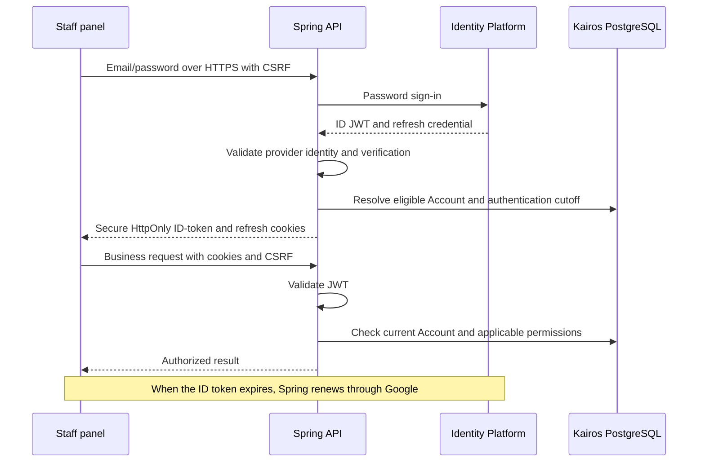

# Delegate staff authentication to Google Cloud Identity Platform

Kairos will replace its local credential verification and custom token issuance
with Google Cloud Identity Platform, integrated through Spring. This reduces
security-sensitive application code and avoids operating a self-hosted identity
provider while preserving Kairos's ownership of tenant and location access.
Implementation was interrupted before completion.
[ADR 0002](0002-clerk-authentication.md) supersedes the Google-specific decisions;
provider-independent product and security decisions remain accepted. The accepted target is also recorded in
[REQUIREMENTS.md, section 4.1.1](../REQUIREMENTS.md#411-google-identity-platform-authentication-2026-10-05),
which remains the canonical product and architecture specification. This ADR
records the rationale, migration scope, and resolved implementation details.

## Decisions and justification

### 1. Managed identity, backend integration

Use Google Cloud Identity Platform rather than self-hosting Keycloak or another
identity provider. Google owns password storage and verification. The first
migration supports email/password, email verification, and Forgot password
through Google's reset mechanism; social login and MFA are deferred.

Spring calls the authentication REST API and uses supported token-verification
facilities. Next.js sends forms directly to Spring and does not authenticate
through Google's browser SDK. Provider tokens are unavailable to JavaScript.
Spring handles submitted passwords transiently, without persisting or logging
them. This keeps the existing REST boundary and reduces browser credential
exposure without introducing a Next.js proxy or Server Actions API layer.

Google handles verification and password-reset email delivery. Do not introduce
a separate mail provider for this increment. Managed delivery reduces setup and
maintenance; it is not a general-purpose invitation-email service.

### 2. Email replaces username completely

Remove username from the domain model, database, API contracts, validation,
forms, collection labels, and destructive confirmations. Email is the sign-in
and displayed staff identifier. Retain stable Kairos Account IDs for foreign
keys, audit attribution, and provider-identity mapping.

Username has no necessary product role and creates duplicate identity handling.
Keep the existing normalized, globally unique email and archived-identity
reservation requirements. Link the validated immutable provider identity to the
Kairos Account; matching email alone is not authority to link an identity or
grant access.

### 3. Google JWTs and automatic refresh

Use Google-issued ID-token JWTs and refresh credentials in Secure, HttpOnly,
host-only cookies with the existing SameSite and CSRF protections. Spring
validates the JWT and automatically refreshes through Google when needed.
Remove Kairos access-JWT signing and its custom refresh-family persistence,
single-use rotation, and replay-detection machinery.

Do not impose Kairos's former seven-day idle or 30-day absolute authentication
expiry. Users may remain signed in while Google refresh remains valid and the
browser retains cookies. Token expiry validation remains mandatory; refresh
failure, revocation, credential changes, logout, or lost cookies may require
sign-in. Cookie retention must be configured explicitly and cannot guarantee
indefinite browser persistence.

This supports regularly active restaurant staff without scheduled password
prompts. Google session-cookie JWTs were considered but not selected: their
maximum two-week fixed lifetime does not meet the desired experience without
additional renewal handling. Opaque server-side sessions were also considered;
Google JWTs were preferred to avoid session lookups and custom token issuance.

### 4. Current permissions remain in Kairos

Every protected business request checks current Account eligibility, tenant
authority, and applicable location eligibility through PostgreSQL-backed
authorization. JWT validation proves identity, not current permission.
Disabling or archiving an Account or location continues to deny access
immediately even when the presented JWT remains cryptographically valid.

Keep checks simple and reuse existing feature boundaries. Do not add permission
caching or optimize every query to reduce reads. Optimize only when measured
performance identifies authorization queries as a bottleneck. This preserves
correctness and maintainability at the project's current scale.

Customer QR tracking stays anonymous. External Integration API Keys retain
their separate authentication and authorization model.

### 5. Two distinct registration flows

Public registration from the main page creates a tenant and its first
administrator only after email verification. Before verification, no Kairos
tenant or Account exists; a Google identity and minimal pending onboarding
context may exist. Registration creates no location, retaining the existing
first-location workflow.

Registration through an Account Invitation link collects email/password and
requires verification. Completion creates the member Account and assigns the
invitation's fixed tenant, location, and role automatically. There is no screen
asking which onboarding flow to choose: the entry point determines it.

Email verification establishes mailbox control and gates Account creation; it
is not spam protection or tenant authorization. Rate limiting remains required
before deployment rather than part of this documentation increment.

Verification can finish on another device. The person signs in there and
resumes the correct flow using server-retained pending context. Verification
alone does not establish an application session. Completion must be idempotent.

These choices avoid incomplete Kairos Accounts and unnecessary user decisions.
Google identity creation and PostgreSQL completion are separate operations;
remote provider operations cannot join a Kairos database transaction.

### 6. Keep member invitations as manually shared bearer links

Staff create and copy a one-time Account Invitation link and send it themselves.
Kairos does not send invitation emails or collect/bind a recipient email at
issuance. The redeemer enters their email and verifies it. Anyone possessing
the link can attempt redemption; email verification does not prove they were
the intended recipient. This is the accepted consequence of keeping delivery
and onboarding simple. Recipient binding and automatic delivery are deferred.

Retain existing seven-day expiry, single-use completion, hashed token storage,
fragment links, one-time presentation, revocation, and audit metadata.
Completion after verification rechecks expiry, revocation, issuer authority,
location eligibility, and existing Account conflicts. Invalid completion must
not consume the invitation. Concurrent completion creates exactly one Account.

An existing Kairos Account cannot redeem another invitation, preserving the
one-tenant and at-most-one-location model. A Google-only identity signs in with
existing credentials and completes onboarding without creating another provider
identity.

Administrators may invite managers and operators to enabled locations in their
tenant. Managers may invite operators only to their own enabled location.
Operators cannot issue invitations. Changing authentication does not change
these authority boundaries.

### 7. Remove Platform Operator onboarding entirely

Remove the Platform Operator Account kind, provisioning/lifecycle command,
workspace, principal variant, Tenant Registration Invitations, associated API
families, schema, configuration, and tests. Public verified registration
replaces their sole current purpose. Member Account Invitations remain.

This removes an unnecessary deployment-wide account and onboarding gate rather
than preserving unused administration functionality for hypothetical later use.

### 8. Simplify request coordination and define logout

Remove the panel's cross-tab Web Lock and general authentication promise queue.
Their primary purpose was coordinating Kairos's single-use refresh credentials.
Multiple tabs are not a primary staff workflow, and no live cross-tab UI
synchronization is added. Concurrent requests still occur within one tab;
minimal refresh/logout handling must prevent an in-flight refresh from
restoring authentication after logout. The old lock is not required to solve it.

Ordinary logout clears credentials in the current browser context, including
its cookie-sharing tabs, without signing out other devices.
Sign out everywhere revokes Google's refresh credentials and immediately
rejects earlier authentication through a per-Account authentication cutoff
checked alongside existing authorization. Compare the provider's authentication
time (`auth_time`), not token issue time (`iat`), so refresh does not turn an old
login into a new authorized authentication.

This keeps ordinary logout unsurprising and provides immediate global rejection
without a separate lookup or Google revocation request on every business call.

## Request flow

## Required migration work

1. **Provider setup:** configure the Identity Platform project, email/password
   method, verification/reset templates and action URLs, API access, backend
   credentials, and separate environment configuration. Keep secrets outside
   source and application images.
2. **Schema and identity:** remove usernames, local password hashes, custom
   refresh-session tables, Platform Operator representation, and Tenant
   Registration Invitations. Retain Account UUIDs, tenant/location relations,
   lifecycle/audit data, normalized email constraints, and member invitations.
   Store immutable provider linkage, authentication cutoff, and the minimum
   pending onboarding state required to resume verification.
3. **Spring authentication:** integrate Google sign-up, password sign-in,
   verification, reset, and refresh; validate issuer, audience, signature,
   expiry, verified email, and provider identity. Adapt cookie/CSRF handling,
   local/global logout, current-Account responses, and authorization resolution.
   Remove local BCrypt verification, custom JWT signing, refresh families, and
   obsolete operator code.
4. **Onboarding:** expose public tenant registration; finalize tenant/admin
   creation after verification. Adapt member invitation completion to verified
   identities and pending context while retaining atomic database completion
   and concurrency protections. Provide recovery for provider success followed
   by application failure without duplicate tenants or consumed invitations.
5. **Panel:** replace username fields and labels with email, add public
   registration and verification/resumption/recovery screens, remove the
   operator workspace and cross-tab lock/queue, adapt refresh and logout flows,
   and retain account-scoped SWR state and clearing on Account changes.
6. **Infrastructure and documentation:** remove only obsolete auth-signing key
   setup/mounts/configuration; preserve webhook, push, and other unrelated keys.
   Update setup, deployment, API contracts, and requirements to match the final
   implementation. Do not reset user data or assume existing credentials can
   be migrated without a deliberate plan.
7. **Verification:** cover provider failures, malformed/expired/unverified
   identities, refresh and logout races, global cutoff enforcement, password
   recovery, cross-browser onboarding resumption, concurrent invitation
   completion, and current tenant/location access. Run affected repository
   checks; manual/browser runtime verification remains separately authorized.

## Resolved implementation details

* Refresh-cookie retention is rolling 365 days; JWT cookies expire with Google.
* One in-flight refresh is shared per tab. Login/logout waits for its response,
  then generation checks prevent obsolete request replay. No general queue or
  cross-tab lock remains.
* Global logout commits the local cutoff and clears cookies before remote
  revocation. `auth_time <= cutoff` fails closed, including same-second logins.
  Provider failure returns 503; local rejection remains effective.
* Google's default email action handler invalidates refresh after password
  reset. Previously issued ID tokens can remain usable until their normal
  expiry (at most about one hour), since business calls perform cached-key
  verification rather than querying Google revocation state. Kairos-driven
  logout and Account/location shutdown remain immediate.
* Pending onboarding retains UID/email/optional invite hash/timestamp without
  credentials or a grant. Sign-in resumes it; explicit credential-authenticated
  registration can replace it with another link after an invitation expires.
  Completion is idempotent, and sending verification can be retried via sign-in.
  Automatic cleanup remains deferred until a retention policy is chosen.
* V2 preserves Account UUIDs and leaves old Accounts unlinked until trusted UID
  mapping. No email-based automatic linking or data reset is performed. Export
  or deliberately replace old credentials before applying V2. See
  [setup and migration](../authentication-setup.md).

## Consequences

Authentication availability and credential lifecycle now depend on Google.
Local development and automated checks need a deliberate provider testing setup.
Provider configuration, email quotas, and future pricing remain operational
concerns. Spring still owns integration failures, cookies, CSRF, authorization,
and database consistency; adopting a provider does not remove those obligations.

The migration reduces custom credential code, operator-only functionality, and
duplicate identifiers. It accepts long-lived browser login and manually shared
bearer invitations in exchange for simpler maintenance and fewer sign-in steps.

## Provider references

* [Identity Platform authentication REST API](https://docs.cloud.google.com/identity-platform/docs/use-rest-api)
* [ID-token verification](https://firebase.google.com/docs/auth/admin/verify-id-tokens)
* [Provider session lifecycle and revocation](https://firebase.google.com/docs/auth/admin/manage-sessions)
* [Google session-cookie alternative](https://firebase.google.com/docs/auth/admin/manage-cookies)
* [Google authentication-email delivery and action links](https://firebase.google.com/docs/auth/admin/email-action-links)
